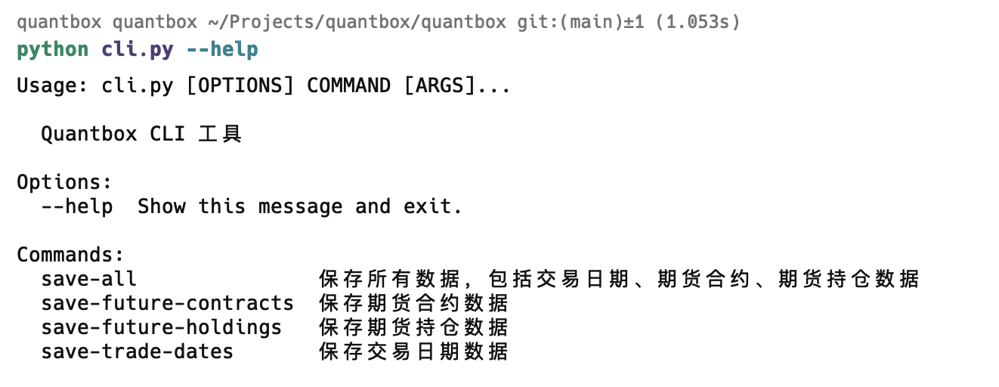

# Quantbox

Quantbox 是一个用于金融数据获取、存储和分析的框架，支持多种数据源和多种金融市场数据。该项目旨在为金融分析师、研究员和开发者提供一个方便、灵活和可扩展的工具包。

## 功能特性

- **数据获取**：支持从多个数据源（如 Tushare、掘金等）获取股票和期货数据。
- **数据存储**：支持将获取的数据存储到本地 MongoDB 数据库。
- **数据查询**：提供便捷的接口查询存储在本地数据库中的数据。
- **命令行工具**：提供 CLI 命令行工具，方便用户执行数据获取和存储操作。

## 安装

首先，确保你已经安装了 Python 和 MongoDB，然后你可以通过以下命令安装项目依赖：

```bash
pip install -r requirements.txt
```

然后安装本项目

```bash
pip install -e .
```

## 配置

在使用之前，你需要配置 `config.toml` 文件，放置在 `~/.quantbox/settings/` 目录下，配置示例如下：

```toml
[TSPRO]
token = "your tushare token"

[GMAPI]
token = "your gm token"

[MONGODB]
uri = "mongodb://localhost:27017"
```

## 使用

### 数据库安装
推荐直接使用 Docker 进行部署，可以进行以下操作：
1. **创建数据卷**
    ```bash
    docker volume create qbmg
    ```
2. **利用 docker-compose 工具配置镜像**
    ```bash
    cd quantbox/docker/qb-base
    docker-compose -f database.yaml up -d
    ```

### 命令行工具

Quantbox 提供了一个便捷的命令行工具，帮助你快速获取和存储数据。



1. **保存所有数据**

    ```bash
    python cli.py save-all
    ```

    该命令会保存所有数据，包括交易日期、期货合约和期货持仓数据。

2. **保存交易日期数据**

    ```bash
    python cli.py save-trade-dates
    ```

    该命令会保存交易日期数据。

3. **保存期货合约数据**

    ```bash
    python cli.py save-future-contracts
    ```

    该命令会保存期货合约数据。

4. **保存期货持仓数据**

    ```bash
    python cli.py save-future-holdings
    ```

    该命令会保存期货持仓数据。

5. **保存股票列表**

    ```bash
    python cli.py save-stock-list
    ```

    该命令会保存股票列表。

6. **保存期货日线行情**

    ```bash
    python cli.py save-future-daily
    ```

    该命令会保存期货日线行情。

### 代码示例

你也可以在代码中直接调用框架提供的接口。

#### 从 Tushare 获取数据

```python
from quantbox import fetch_get_trade_dates, fetch_get_future_contracts, fetch_get_holdings

# 获取交易日期数据
trade_dates = fetch_get_trade_dates(exchanges="SSE", start_date="2023-01-01", end_date="2023-12-31")
print(trade_dates)

# 获取期货合约数据
future_contracts = fetch_get_future_contracts(exchange="DCE", spec_name="豆粕")
print(future_contracts)

# 获取期货持仓数据
holdings = fetch_get_holdings(exchanges="DCE", cursor_date="2023-09-30")
print(holdings)
```

#### 从本地数据库查询数据

```python
from quantbox import fetch_trade_dates, fetch_pre_trade_date, fetch_next_trade_date, fetch_future_contracts, fetch_future_holdings

# 查询交易日期数据
local_trade_dates = fetch_trade_dates(exchanges="SSE", start_date="2023-01-01", end_date="2023-12-31")
print(local_trade_dates)

# 查询前 N 个交易日
pre_trade_date = fetch_pre_trade_date(exchange="SSE", cursor_date="2023-09-30", n=1)
print(pre_trade_date)

# 查询后 N 个交易日
next_trade_date = fetch_next_trade_date(exchange="SSE", cursor_date="2023-09-30", n=1)
print(next_trade_date)

# 查询期货合约数据
local_future_contracts = fetch_future_contracts(exchanges="DCE", spec_name="豆粕")
print(local_future_contracts)

# 查询期货持仓数据
local_holdings = fetch_future_holdings(exchanges="DCE", cursor_date="2023-09-30")
print(local_holdings)
```

## 贡献指南

如果你愿意为本项目贡献代码和想法，请阅读[贡献指南](CONTRIBUTING.md)。

## 常见问题

你可以在[常见问题](FAQ.md)页面找到常见问题的解答。

## 许可证

本项目基于 MIT 许可证，请参阅 [LICENSE](LICENSE) 文件了解更多细节。
