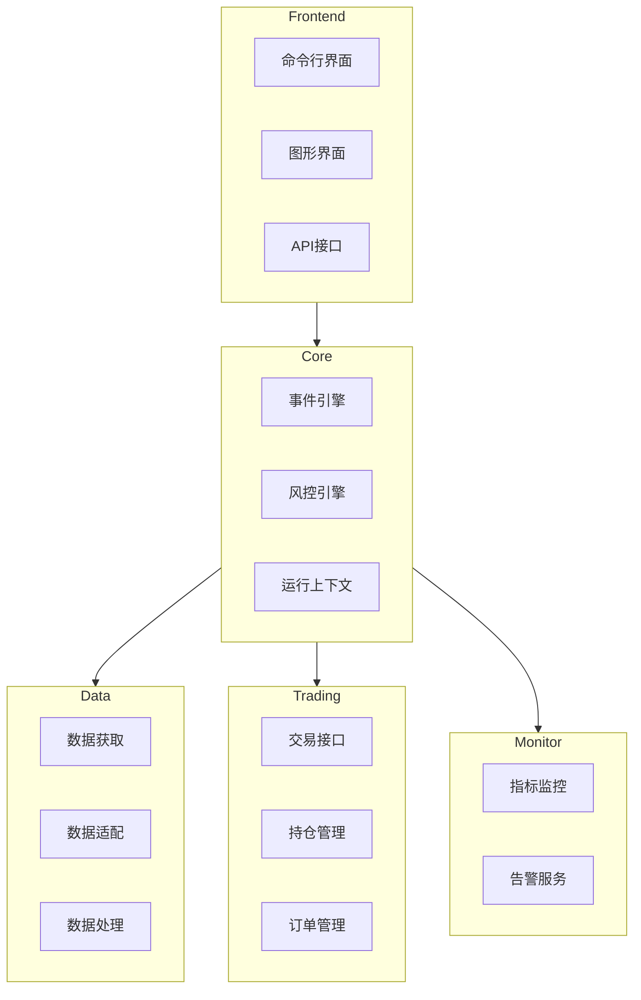

# QuantBox

QuantBox 是一个全面的量化投资研究平台，支持股票、期货、期权、加密货币等多品种的在线查询、数据存储和交易分析。

## 系统架构

### 整体架构



## 目录结构

```
quantbox/
├── core/                 # 核心功能模块
│   ├── engine/          # 引擎模块
│   │   ├── event.py     # 事件引擎
│   │   └── risk.py      # 风控引擎
│   ├── context/         # 运行上下文
│   └── config/          # 配置管理
│
├── data/                # 数据模块
│   ├── fetcher/        # 数据获取
│   ├── adapter/        # 数据适配
│   └── processor/      # 数据处理
│
├── trading/            # 交易模块
│   ├── gateway/       # 交易接口
│   ├── position/      # 持仓管理
│   └── order/         # 订单管理
│
├── strategy/          # 策略模块
│   ├── base.py       # 策略基类
│   └── plugins/      # 策略插件
│
├── monitor/          # 监控模块
│   ├── metrics/     # 指标监控
│   └── alert/       # 告警服务
│
└── utils/           # 工具模块
```

## 配置管理

QuantBox 使用 TOML 格式的配置文件，默认从用户主目录下的 `~/.settings/quantbox/config.toml` 读取。您可以参考项目根目录下的 `example.config.toml` 创建自己的配置文件。

主要配置项包括：

1. **数据库配置**
   - MongoDB 连接信息
   - 集合前缀设置

2. **API配置**
   - TuShare Token
   - Wind Token
   - 天勤账号密码
   - 掘金量化Token

3. **日志配置**
   - 日志级别
   - 文件路径
   - 轮转设置

4. **缓存配置**
   - 缓存类型（内存/Redis）
   - Redis连接信息
   - 过期时间

5. **交易配置**
   - 默认交易所
   - 时区设置
   - 手续费率
   - 滑点设置

## 核心特性

1. **事件驱动架构**
   - 基于事件的微服务设计
   - 支持异步任务处理
   - 灵活的插件机制

2. **数据管理**
   - 统一的数据适配层
   - 多数据源支持
   - 实时/历史数据处理

3. **策略开发**
   - 插件式策略管理
   - 支持实盘和回测
   - 策略热更新

4. **风险控制**
   - 实时风控监控
   - 多维度指标计算
   - 灵活的告警机制

5. **监控分析**
   - 实时性能监控
   - 多维度指标分析
   - 自定义告警规则

## 数据管理

### 交易日历

QuantBox 提供了两种方式来保存交易日历数据：

1. **命令行工具**

```bash
# 查看帮助信息
python -m quantbox.cli.trade_dates --help

# 保存所有交易所的数据（默认行为）
python -m quantbox.cli.trade_dates

# 保存单个交易所的数据（如上交所）
python -m quantbox.cli.trade_dates -e SSE

# 保存所有股票交易所的数据
python -m quantbox.cli.trade_dates -t STOCK

# 保存所有期货交易所的数据
python -m quantbox.cli.trade_dates -t FUTURES

# 保存指定日期范围的数据
python -m quantbox.cli.trade_dates -e SSE -s 20240101 -d 20241231
```

2. **脚本方式**

```bash
# 查看帮助信息
python scripts/save_trade_dates.py --help

# 保存所有交易所的数据（默认行为）
python scripts/save_trade_dates.py

# 保存单个交易所的数据（如上交所）
python scripts/save_trade_dates.py -e SSE

# 保存所有股票交易所的数据
python scripts/save_trade_dates.py -t STOCK

# 保存所有期货交易所的数据
python scripts/save_trade_dates.py -t FUTURES

# 保存指定日期范围的数据
python scripts/save_trade_dates.py -e SSE -s 20240101 -d 20241231
```

注意事项：
1. 默认从 1989 年 1 月 1 日开始获取数据
2. 如果不指定结束日期，则使用当年年底作为结束日期
3. 如果不指定交易所或类型，则默认保存所有交易所的数据
4. 支持的交易所类型：
   - 股票：SSE（上交所）、SZSE（深交所）
   - 期货：SHFE（上期所）、DCE（大商所）、CZCE（郑商所）、CFFEX（中金所）、INE（能源所）、GFEX（广期所）
5. 数据会保存到配置文件中指定的 MongoDB 数据库中

## 开发指南

详细的开发文档请参考 [docs/](docs/) 目录：

- [快速开始](docs/quickstart.md)
- [配置说明](docs/configuration.md)
- [API文档](docs/api.md)
- [策略开发](docs/strategy.md)
- [数据接入](docs/data.md)

## 贡献指南

欢迎提交 Issue 和 Pull Request。在提交 PR 之前，请确保：

1. 代码符合 PEP 8 规范
2. 添加了必要的测试用例
3. 更新了相关文档
4. 所有测试用例通过

## 许可证

本项目采用 MIT 许可证，详见 [LICENSE](LICENSE) 文件。
