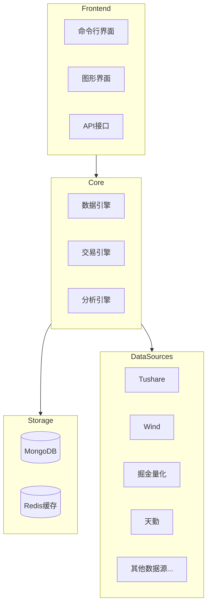
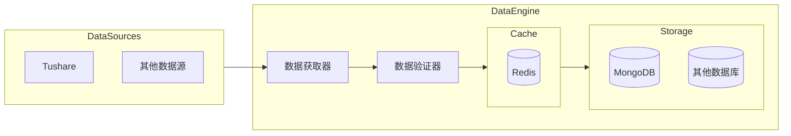
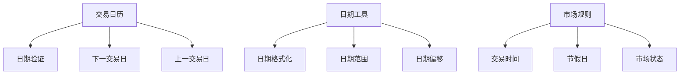

# QuantBox

QuantBox 是一个全面的量化投资研究平台，支持股票、期货、期权、加密货币等多品种的在线查询、数据存储和交易分析。

## 系统架构

### 整体架构



### 数据引擎架构



## 代码组织

```
quantbox/
├── core/                   # 核心功能模块
│   ├── engine/            # 引擎实现
│   ├── data/              # 数据结构定义
│   └── utils/             # 工具函数
├── datasource/            # 数据源接口
│   ├── base.py           # 基础接口定义
│   ├── tushare/          # Tushare实现
│   └── wind/             # Wind实现
├── storage/              # 存储模块
│   ├── base.py          # 存储接口定义
│   ├── mongodb/         # MongoDB实现
│   └── redis/           # Redis缓存实现
├── trading/             # 交易模块
│   ├── base.py         # 交易接口定义
│   └── backtest/       # 回测实现
├── analysis/           # 分析模块
├── cli/               # 命令行工具
└── gui/               # 图形界面
```

## 核心特性

1. **多数据源支持**
   - 默认使用 Tushare 作为基础数据源
   - 支持 Wind、掘金量化、天勤等多个数据源
   - 可扩展的数据源接口设计

2. **高效的数据存储**
   - 使用 MongoDB 作为默认数据库
   - Redis 缓存层提升查询性能
   - 支持多种数据库后端

3. **全面的品种支持**
   - 股票：A股、港股、美股
   - 期货：国内期货、国际期货
   - 期权：股票期权、商品期权
   - 加密货币

4. **高性能实现**
   - 核心模块支持 Rust 实现
   - 高效的数据处理和分析
   - 优化的回测引擎

## 开发路线

### Phase 1: 基础框架搭建
- [x] 项目结构设计
- [ ] 交易日期处理模块
- [ ] 数据源基础接口
- [ ] 存储层基础实现

### Phase 2: 数据获取与存储
- [ ] Tushare 数据源实现
- [ ] MongoDB 存储实现
- [ ] Redis 缓存实现
- [ ] 数据验证功能

### Phase 3: 功能扩展
- [ ] 更多数据源支持
- [ ] 交易功能实现
- [ ] 分析功能实现
- [ ] GUI 界面开发

## 交易日期处理

交易日期模块是整个系统的基础模块之一，主要负责处理以下功能：


