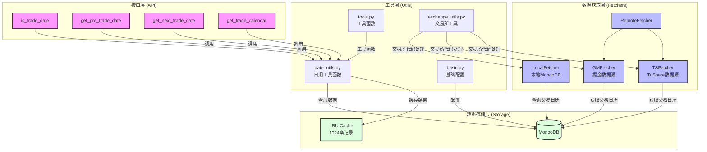

# 交易日期系统设计文档

## 系统架构



## 系统组件

### 1. 数据获取层 (Fetchers)

#### RemoteFetcher
- 统一的远程数据获取接口
- 支持多数据源配置
- 负责数据源的切换和错误处理
- 使用统一的交易所代码标准

#### TSFetcher (TuShare)
- TuShare数据源的具体实现
- 获取A股和期货市场的交易日历
- 支持所有主要交易所
- 自动处理交易所代码映射

#### GMFetcher (掘金)
- 掘金量化数据源的具体实现
- 获取A股和期货市场的交易日历
- 支持实时数据更新
- 兼容统一的交易所代码标准

#### LocalFetcher
- 本地MongoDB数据获取接口
- 提供高效的本地数据查询
- 支持数据缓存和更新
- 使用标准化的交易所代码

### 2. 数据存储层 (Storage)

#### MongoDB
- 持久化存储交易日历数据
- 支持高效的日期范围查询
- 存储格式：
  ```python
  {
    "exchange": "交易所代码",  # 使用标准化的交易所代码
    "trade_date": "交易日期",
    "pretrade_date": "前一交易日",
    "datestamp": "日期时间戳"
  }
  ```

#### LRU Cache
- 使用Python内置的`@lru_cache`装饰器
- 缓存大小：1024条记录
- 缓存常用的交易日期查询结果
- 显著提升查询性能

### 3. 工具层 (Utils)

#### date_utils.py
- 核心日期工具函数
- 提供日期格式转换
- 实现交易日期计算逻辑

#### basic.py
- 基础配置管理
- 数据库连接配置
- 全局常量定义

#### tools.py
- 通用工具函数
- 日期格式化
- 数据验证

#### exchange_utils.py
- 交易所代码标准化
- 代码映射和验证
- 支持批量处理
- 错误处理和日志记录

### 4. 接口层 (API)

#### is_trade_date
```python
def is_trade_date(
    cursor_date: Union[str, int, datetime.date, None] = None,
    exchange: str = 'SHSE'  # 支持 SSE/SHSE
) -> bool:
    """判断指定日期是否为交易日"""
```

#### get_pre_trade_date
```python
def get_pre_trade_date(
    cursor_date: Union[str, int, datetime.date, None] = None,
    exchange: str = 'SHSE',  # 支持 SSE/SHSE
    n: int = 1,
    include_input: bool = False
) -> Optional[Dict[str, Any]]:
    """获取指定日期之前的第n个交易日"""
```

#### get_next_trade_date
```python
def get_next_trade_date(
    cursor_date: Union[str, int, datetime.date, None] = None,
    exchange: str = 'SHSE',  # 支持 SSE/SHSE
    n: int = 1,
    include_input: bool = False
) -> Optional[Dict[str, Any]]:
    """获取指定日期之后的第n个交易日"""
```

#### get_trade_calendar
```python
def get_trade_calendar(
    start_date: Union[str, int, datetime.date, None] = None,
    end_date: Union[str, int, datetime.date, None] = None,
    exchange: str = 'SHSE'  # 支持 SSE/SHSE
) -> pd.DataFrame:
    """获取指定日期范围内的交易日历"""
```

## 主要特点

1. **多数据源支持**
   - 支持TuShare和掘金两个主要数据源
   - 可以方便地扩展新的数据源
   - 数据源之间可以相互验证

2. **本地缓存优化**
   - MongoDB本地存储，减少网络请求
   - LRU缓存常用查询，提升性能
   - 定期更新机制，保证数据准确性

3. **统一的接口设计**
   - 简洁清晰的API设计
   - 支持多种日期格式输入
   - 完善的参数验证和错误处理

4. **完善的测试覆盖**
   - 单元测试覆盖所有核心功能
   - 集成测试验证数据一致性
   - 边界条件测试确保稳定性

5. **交易所代码标准化**
   - 统一的交易所代码标准
   - 自动代码映射和转换
   - 兼容多种代码格式
   - 完善的错误处理

## 使用示例

### 基本用法
```python
from quantbox.util.date_utils import (
    is_trade_date,
    get_pre_trade_date,
    get_next_trade_date,
    get_trade_calendar
)

# 判断是否为交易日（支持多种交易所代码格式）
is_trade = is_trade_date("2024-01-08", "SSE")  # 使用 SSE
is_trade = is_trade_date("2024-01-08", "SHSE")  # 使用 SHSE

# 获取前一交易日
pre_date = get_pre_trade_date("2024-01-08", "SHSE", n=1)

# 获取下一交易日
next_date = get_next_trade_date("2024-01-08", "SHSE", n=1)

# 获取交易日历
calendar = get_trade_calendar(
    start_date="2024-01-01",
    end_date="2024-01-31",
    exchange="SHSE"
)
```

### 交易所代码处理
```python
from quantbox.util.exchange_utils import (
    normalize_exchange,
    denormalize_exchange,
    validate_exchanges
)

# 标准化交易所代码
normalized = normalize_exchange("SSE")  # 返回 "SHSE"

# 反标准化交易所代码
original = denormalize_exchange("SHSE")  # 返回 "SSE"

# 验证交易所代码
valid_codes = validate_exchanges(["SSE", "SZSE"])  # 返回 ["SHSE", "SZSE"]

# 批量处理
codes = ["SSE", "SZSE", None]  # None 将使用默认值
valid_codes = validate_exchanges(codes)  # 返回 ["SHSE", "SZSE"]
```

## 配置说明

系统配置通过`~/.quantbox/settings/config.toml`文件管理，主要配置项包括：

1. **数据库配置**
   ```toml
   [mongodb]
   host = "localhost"
   port = 27017
   database = "quantbox"
   ```

2. **数据源配置**
   ```toml
   [tushare]
   token = "your_tushare_token"
   
   [goldminer]
   username = "your_username"
   password = "your_password"
   ```

3. **缓存配置**
   ```toml
   [cache]
   trade_dates_size = 1024  # 交易日期缓存大小
   ```

## 扩展新数据源

1. **添加配置项**
   在 `~/.quantbox/settings/config.toml` 中添加新数据源的配置：
   ```toml
   [new_data_source]
   api_key = "your_api_key"
   ```

2. **实现数据源类**
   ```python
   from quantbox.fetchers.base import BaseFetcher
   from quantbox.util.exchange_utils import validate_exchanges
   
   class NewDataSourceFetcher(BaseFetcher):
       def __init__(self):
           super().__init__()
           # 初始化新数据源
   
       def fetch_get_trade_dates(
           self,
           exchanges: Union[List[str], str, None] = None,
           start_date: Union[str, int, datetime.date, None] = None,
           end_date: Union[str, int, datetime.date, None] = None
       ) -> pd.DataFrame:
           # 验证和标准化交易所代码
           exchanges = validate_exchanges(exchanges)
           # 实现数据获取逻辑
           pass
   ```

3. **注册数据源**
   在 `RemoteFetcher` 中添加新数据源：
   ```python
   class RemoteFetcher:
       def __init__(self, engine='ts'):
           self.engines = {
               'ts': TSFetcher,
               'gm': GMFetcher,
               'new': NewDataSourceFetcher,  # 添加新数据源
           }
   ```

## 性能优化

1. **缓存优化**
   - 使用 LRU 缓存减少重复查询
   - 批量获取数据减少网络请求
   - 定期预加载常用数据

2. **数据库优化**
   - 创建合适的索引
   - 使用批量操作
   - 定期清理过期数据

3. **代码优化**
   - 使用向量化操作
   - 避免循环和重复计算
   - 优化数据结构

## 常见问题

1. **交易所代码不一致**
   - 问题：不同数据源使用不同的交易所代码
   - 解决：使用 `exchange_utils.py` 进行标准化
   ```python
   from quantbox.util.exchange_utils import normalize_exchange
   normalized_code = normalize_exchange("SSE")  # 返回 "SHSE"
   ```

2. **日期格式不统一**
   - 问题：输入日期格式多样
   - 解决：使用统一的日期处理函数
   ```python
   from quantbox.util.date_utils import normalize_date
   standard_date = normalize_date("2024-01-08")  # 支持多种格式
   ```

3. **性能问题**
   - 问题：频繁查询导致性能下降
   - 解决：使用缓存和批量查询
   ```python
   # 使用批量查询
   date_ranges = [(20240101, 20240131), (20240201, 20240229)]
   results = fetcher.fetch_get_trade_dates_batch(date_ranges)
   ```
