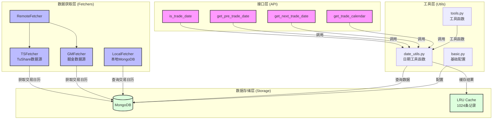

# 交易日期系统设计文档

## 系统架构



## 系统组件

### 1. 数据获取层 (Fetchers)

#### RemoteFetcher
- 统一的远程数据获取接口
- 支持多数据源配置
- 负责数据源的切换和错误处理

#### TSFetcher (TuShare)
- TuShare数据源的具体实现
- 获取A股和期货市场的交易日历
- 支持所有主要交易所

#### GMFetcher (掘金)
- 掘金量化数据源的具体实现
- 获取A股和期货市场的交易日历
- 支持实时数据更新

#### LocalFetcher
- 本地MongoDB数据获取接口
- 提供高效的本地数据查询
- 支持数据缓存和更新

### 2. 数据存储层 (Storage)

#### MongoDB
- 持久化存储交易日历数据
- 支持高效的日期范围查询
- 存储格式：
  ```python
  {
    "exchange": "交易所代码",
    "trade_date": "交易日期",
    "pretrade_date": "前一交易日",
    "datestamp": "日期时间戳"
  }
  ```

#### LRU Cache
- 使用Python内置的`@lru_cache`装饰器
- 缓存大小：1024条记录
- 缓存常用的交易日期查询结果
- 显著提升查询性能

### 3. 工具层 (Utils)

#### date_utils.py
- 核心日期工具函数
- 提供日期格式转换
- 实现交易日期计算逻辑

#### basic.py
- 基础配置管理
- 数据库连接配置
- 全局常量定义

#### tools.py
- 通用工具函数
- 日期格式化
- 数据验证

### 4. 接口层 (API)

#### is_trade_date
```python
def is_trade_date(
    cursor_date: Union[str, int, datetime.date, None] = None,
    exchange: str = 'SHSE'
) -> bool:
    """判断指定日期是否为交易日"""
```

#### get_pre_trade_date
```python
def get_pre_trade_date(
    cursor_date: Union[str, int, datetime.date, None] = None,
    exchange: str = 'SHSE',
    n: int = 1,
    include_input: bool = False
) -> Optional[Dict[str, Any]]:
    """获取指定日期之前的第n个交易日"""
```

#### get_next_trade_date
```python
def get_next_trade_date(
    cursor_date: Union[str, int, datetime.date, None] = None,
    exchange: str = 'SHSE',
    n: int = 1,
    include_input: bool = False
) -> Optional[Dict[str, Any]]:
    """获取指定日期之后的第n个交易日"""
```

#### get_trade_calendar
```python
def get_trade_calendar(
    start_date: Union[str, int, datetime.date, None] = None,
    end_date: Union[str, int, datetime.date, None] = None,
    exchange: str = 'SHSE'
) -> pd.DataFrame:
    """获取指定日期范围内的交易日历"""
```

## 主要特点

1. **多数据源支持**
   - 支持TuShare和掘金两个主要数据源
   - 可以方便地扩展新的数据源
   - 数据源之间可以相互验证

2. **本地缓存优化**
   - MongoDB本地存储，减少网络请求
   - LRU缓存常用查询，提升性能
   - 定期更新机制，保证数据准确性

3. **统一的接口设计**
   - 简洁清晰的API设计
   - 支持多种日期格式输入
   - 完善的参数验证和错误处理

4. **完善的测试覆盖**
   - 单元测试覆盖所有核心功能
   - 集成测试验证数据一致性
   - 边界条件测试确保稳定性

## 使用示例

```python
from quantbox.util.date_utils import (
    is_trade_date,
    get_pre_trade_date,
    get_next_trade_date,
    get_trade_calendar
)

# 判断是否为交易日
is_trade = is_trade_date("2024-01-08", "SHSE")

# 获取前一交易日
pre_date = get_pre_trade_date("2024-01-08", "SHSE", n=1)

# 获取下一交易日
next_date = get_next_trade_date("2024-01-08", "SHSE", n=1)

# 获取交易日历
calendar = get_trade_calendar("2024-01-01", "2024-01-31", "SHSE")
```

## 配置说明

系统配置通过`~/.quantbox/settings/config.toml`文件管理，主要配置项包括：

1. **数据库配置**
   ```toml
   [mongodb]
   uri = "mongodb://localhost:27018"
   database = "quantbox"
   ```

2. **数据源配置**
   ```toml
   [tushare]
   token = "your_tushare_token"

   [goldminer]
   token = "your_goldminer_token"
   ```

## 注意事项

1. 首次使用前需要初始化本地数据库
2. 建议定期更新交易日历数据
3. 不同数据源的交易日历可能存在细微差异
4. LRU缓存在程序重启后会清空

## 数据源接入指南

### 1. 基类接口说明

所有数据源必须继承 `BaseFetcher` 类并实现以下接口：

```python
class BaseFetcher:
    """Abstract base class for all data fetchers
    所有数据获取器的抽象基类
    """
    def __init__(self):
        """初始化数据获取器"""
        self.validator = DataValidator()
        self.exchanges = []  # 支持的交易所列表
        self.stock_exchanges = []  # 支持的股票交易所列表
        self.future_exchanges = []  # 支持的期货交易所列表
        self.client = None  # 数据库客户端
        self.default_start = None  # 默认起始日期

    def fetch_get_trade_dates(
        self,
        exchanges: Union[List[str], str, None] = None,
        start_date: Union[str, datetime.date, int, None] = None,
        end_date: Union[str, datetime.date, int, None] = None,
    ) -> pd.DataFrame:
        """获取交易日历数据
        
        Returns:
            DataFrame with required columns:
            - exchange: Exchange code
            - trade_date: Trading date (YYYY-MM-DD)
            - pretrade_date: Previous trading date
            - datestamp: Unix timestamp
        """
        raise NotImplementedError
```

### 2. 实现步骤

1. **创建新的数据源类**
   ```python
   from quantbox.fetchers.base import BaseFetcher
   
   class NewDataSourceFetcher(BaseFetcher):
       def __init__(self):
           super().__init__()
           # 初始化数据源特定的配置
           self.exchanges = ["SHSE", "SZSE", ...]  # 定义支持的交易所
           self.api_client = None  # 初始化API客户端
   ```

2. **实现必要的接口方法**
   ```python
   def fetch_get_trade_dates(
       self,
       exchanges: Union[List[str], str, None] = None,
       start_date: Union[str, datetime.date, int, None] = None,
       end_date: Union[str, datetime.date, int, None] = None,
   ) -> pd.DataFrame:
       """实现交易日历获取逻辑"""
       try:
           # 1. 参数处理
           if exchanges is None:
               exchanges = self.exchanges
           elif isinstance(exchanges, str):
               exchanges = [exchanges]
           
           # 2. 调用数据源API
           raw_data = self.api_client.get_trade_dates(...)
           
           # 3. 数据格式转换
           df = pd.DataFrame(raw_data)
           
           # 4. 确保返回必要的字段
           df = df.rename(columns={
               'date': 'trade_date',
               'prev_date': 'pretrade_date',
               ...
           })
           
           # 5. 添加datestamp字段
           df['datestamp'] = pd.to_datetime(df['trade_date']).map(lambda x: x.timestamp())
           
           return df
           
       except Exception as e:
           self._handle_error(e, "fetch_get_trade_dates")
   ```

3. **添加数据验证**
   ```python
   def _validate_trade_dates(self, df: pd.DataFrame) -> pd.DataFrame:
       """验证交易日历数据的格式"""
       required_columns = [
           'exchange',
           'trade_date',
           'pretrade_date',
           'datestamp'
       ]
       
       # 使用内置的验证器
       self.validator.validate_dataframe(df, required_columns)
       return df
   ```

4. **实现错误处理**
   ```python
   def _handle_error(self, error: Exception, context: str):
       """处理数据源特定的错误"""
       if isinstance(error, APIError):
           # 处理API特定的错误
           raise RuntimeError(f"API错误: {str(error)}")
       else:
           # 调用基类的错误处理
           super()._handle_error(error, context)
   ```

### 3. 数据格式规范

#### 交易日历数据格式
```python
{
    "exchange": str,      # 交易所代码，如 "SHSE"
    "trade_date": str,    # 交易日期，格式 "YYYY-MM-DD"
    "pretrade_date": str, # 前一交易日，格式 "YYYY-MM-DD"
    "datestamp": float    # Unix时间戳
}
```

#### 支持的交易所代码
```python
EXCHANGES = [
    "SHSE",  # 上海证券交易所
    "SZSE",  # 深圳证券交易所
    "SHFE",  # 上海期货交易所
    "DCE",   # 大连商品交易所
    "CZCE",  # 郑州商品交易所
    "CFFEX", # 中国金融期货交易所
    "INE"    # 上海国际能源交易中心
]
```

### 4. 配置管理

1. **添加配置项**
   在 `~/.quantbox/settings/config.toml` 中添加新数据源的配置：
   ```toml
   [new_data_source]
   api_key = "your_api_key"
   api_secret = "your_api_secret"
   base_url = "https://api.example.com"
   ```

2. **读取配置**
   ```python
   from quantbox.util.basic import Config
   
   class NewDataSourceFetcher(BaseFetcher):
       def __init__(self):
           super().__init__()
           config = Config()
           self.api_key = config.config.get("new_data_source", {}).get("api_key")
           self.api_secret = config.config.get("new_data_source", {}).get("api_secret")
   ```

### 5. 性能优化建议

1. **使用缓存装饰器**
   ```python
   from quantbox.fetchers.cache import cache_result
   
   @cache_result(ttl=3600)  # 缓存1小时
   def fetch_get_trade_dates(self, ...):
       pass
   ```

2. **批量获取数据**
   ```python
   def fetch_get_trade_dates(self, ...):
       # 批量获取数据而不是循环调用API
       all_data = self.api_client.batch_get_trade_dates(
           exchanges=exchanges,
           start_date=start_date,
           end_date=end_date
       )
   ```

3. **异常重试机制**
   ```python
   from quantbox.fetchers.utils import retry_on_error
   
   @retry_on_error(max_retries=3, delay=1)
   def fetch_get_trade_dates(self, ...):
       pass
   ```

### 6. 测试要求

1. **单元测试**
   ```python
   # tests/test_new_data_source.py
   def test_fetch_trade_dates():
       fetcher = NewDataSourceFetcher()
       df = fetcher.fetch_get_trade_dates(
           exchanges=["SHSE"],
           start_date="2024-01-01",
           end_date="2024-01-31"
       )
       assert set(df.columns) == {
           "exchange",
           "trade_date",
           "pretrade_date",
           "datestamp"
       }
   ```

2. **集成测试**
   ```python
   def test_trade_dates_integration():
       # 对比不同数据源的结果
       new_fetcher = NewDataSourceFetcher()
       ts_fetcher = TSFetcher()
       
       new_data = new_fetcher.fetch_get_trade_dates(...)
       ts_data = ts_fetcher.fetch_get_trade_dates(...)
       
       pd.testing.assert_frame_equal(new_data, ts_data)
   ```

### 7. 注意事项

1. 确保实现所有必要的接口方法
2. 正确处理日期格式转换
3. 实现适当的错误处理和重试机制
4. 添加完整的文档字符串
5. 编写全面的测试用例
6. 考虑添加性能监控
7. 实现数据验证逻辑
